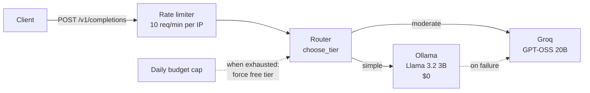

# LLM Cost Autopilot

A routing layer that sends each LLM request to the **cheapest model that can handle it reliably** — and proves it with measured data.

Most teams send every request to their most expensive model, paying premium prices for tasks a small model answers just as well. This service classifies each prompt, routes it to the right tier, enforces a daily spend cap, and reports why every routing decision was made.

**Live API:** `http://91.99.98.217:8000/docs` (interactive — try `POST /v1/completions`)

> Cost figures use published list pricing (verified 2026-09-20). Development runs on free tiers, so actual spend is $0 — the routing logic is price-agnostic and identical for paid models.

---

## Results so far

Measured on a 24-prompt golden dataset, each prompt run 3 times per model at temperature 0, auto-graded against verified answers:

| Tier | Prompts | Handled by |
|---|---|---|
| simple | 12 | free local model (Llama 3.2 3B), passed 3/3 runs |
| moderate | 12 | Groq GPT-OSS 20B — the local model failed or was unreliable |
| complex | 0 | nothing required the 120B model |

- **The 20B model passed every auto-graded prompt, 3/3.** On this dataset the most expensive tier added no quality.
- **Preliminary savings: ~75%** vs. sending everything to the 120B, at the same pass rate (routed: 12 free + 12 on 20B). Small sample — treated as a hypothesis until measured on the larger set in progress (140 items, `data/golden_v3.json`).
- **The local model's failure modes are consistent:** multi-step arithmetic, time/date math, arithmetic over long lists, letter counting, multi-hop logic, nuanced sentiment, and strict output formatting.

### Findings worth knowing

- **Price per token ≠ cost per task.** The 120B costs 2x per token, but the 20B is wordier; measured cost per task was ~1.4–1.9x, not 2x. The router must optimize on measured cost, not list price.
- **Temperature 0 is not full determinism.** The local model flipped on the same prompt between runs. Items that flip are exactly the boundary of a model's ability — tiers are labeled from repeated runs, and anything unreliable goes up a tier.
- **Tighter output instructions can move a task down a tier.** Asking for "only the name" made the 3B model answer a logic question correctly that it got wrong while explaining.
- **Benchmarks have bugs too.** Two test items were ambiguous and one `contains` check produced a false pass (it matched the explanation, not the answer). All grading checks were tightened; see `INCIDENTS.md`.

---

## Architecture



- **Provider abstraction** — one `Provider` interface (`send(prompt, config) -> Response`) with Groq, Ollama and Gemini implementations. Each normalizes its API's response shape into the same `Response` (text, tokens, latency, cost, model).
- **Model registry** — models, list prices and quality tiers live in config (`app/models/registry.py`), not code. Swapping in a company's paid models is a config change.
- **Router v1 (rule-based)** — `choose_tier()` flags prompts with the signals the benchmark showed the small model fails on (several numbers, calculation keywords, comparison chains, letter counting, sentiment, long input). Every response includes a `routing_reason`. Rules are deliberately conservative: a wrong "moderate" costs a fraction of a cent; a wrong "simple" costs quality.
- **Fallback** — if the local model fails, the request is retried on the 20B and the reason is recorded. Paid fallback is disabled once the daily budget is spent.

### Model tiers

| Key | Model | Input / Output per 1M tokens | Role |
|---|---|---|---|
| `ollama-local` | Llama 3.2 3B (self-hosted) | $0 / $0 | simple tier |
| `groq-20b` | GPT-OSS 20B | $0.075 / $0.30 | moderate tier, fallback |
| `groq-120b` | GPT-OSS 120B | $0.15 / $0.60 | benchmarked; reserved for escalation (Phase 3) |

The Gemini provider is implemented but excluded: the API was unavailable from the development region.

---

## API

| Method | Path | Purpose |
|---|---|---|
| `GET` | `/health` | status, deployed version, environment |
| `POST` | `/v1/completions` | route a prompt and return the answer with routing metadata |
| `GET` | `/v1/budget` | today's paid spend vs. the daily cap |

Example:

```bash
curl -s -X POST http://91.99.98.217:8000/v1/completions \
  -H "Content-Type: application/json" \
  -d '{"prompt": "A car uses 6.5 liters per 100 km. Fuel costs $1.80 per liter. What does fuel cost for 340 km?"}'
```

```json
{
  "text": "... The fuel cost for traveling 340 km is $39.78.",
  "model": "groq-20b",
  "tier": "moderate",
  "cost_usd": 0.00008685,
  "latency_ms": 1871,
  "routing_reason": "6 numbers in prompt: arithmetic risk"
}
```

### Protection

- **Rate limit:** 10 requests/minute per IP (HTTP 429 beyond that).
- **Daily budget cap:** $0.05/day of paid spend by default. Once reached, every request is served by the free tier and `routing_reason` says so.

Both are configurable via environment variables (`RATE_LIMIT`, `DAILY_BUDGET_USD`).

---

## Deployment

```
git push → GitHub Actions: test → build image → push to ghcr.io (:latest + :<commit-sha>) → SSH deploy → smoke test (/health)
```

- **Every commit to `main` ships automatically.** Tests gate the build, the build gates the deploy, and the deploy fails visibly if the smoke test doesn't return 200.
- **Build once, deploy the artifact.** The server never builds code; it pulls the image CI built and tested. SHA-tagged images make rollback a single pull.
- **Server:** Hetzner CX23 (2 vCPU, 4 GB RAM), Docker Compose running the API and Ollama. Ollama has no public port — it's reachable only by the API over Docker's internal network. The model is kept loaded (`OLLAMA_KEEP_ALIVE`) to avoid cold starts.
- **Hardening:** non-root deploy user, key-only SSH, root login disabled, ufw firewall, admin access over Tailscale, dedicated deploy key stored only in GitHub Actions secrets, secrets never committed (GitHub push protection caught one attempt — see `INCIDENTS.md`).

Measured latency on the server: Groq ~1.9s; local model ~13.6s cold start, warm latency being measured. The free tier trades latency for cost — on 2 CPU cores that tradeoff is real, and it's part of what the router weighs.

---

## Evaluation harness

The routing decisions are only as good as the evidence behind them, so the project includes a reproducible benchmark:

| Script | Purpose |
|---|---|
| `scripts/benchmark.py` | runs every golden prompt on every model, records cost, latency and tokens, grades each answer |
| `scripts/grading.py` | grading rules: `exact`, `contains`, `json`, `manual` |
| `scripts/tier_report.py` | aggregates several runs and assigns each prompt the cheapest tier that passed reliably |
| `scripts/show_answers.py` | prints all models' answers side by side for manual review |
| `scripts/generate_prompts.py` | generates synthetic prompts with Python-computed answers (ground truth can't be mistyped) |

Datasets live in `data/` and are versioned like code (`golden_v1` → `v2` → `v3`), so it's always clear when the evaluation bar changed.

---

## Run locally

```bash
python -m venv .venv && source .venv/bin/activate      # Windows: .venv\Scripts\activate
pip install -r requirements.txt -r requirements-dev.txt
cp .env.example .env                                   # then add your GROQ_API_KEY
ollama pull llama3.2:3b
uvicorn app.main:app --reload
```

Tests (no API keys or network needed — providers are faked):

```bash
python -m pytest -v
```

Benchmark:

```bash
python -m scripts.benchmark
python -m scripts.tier_report results/<run1>.json results/<run2>.json results/<run3>.json
```

---

## Project structure

```
app/
  main.py              FastAPI app: /health, /v1/completions, /v1/budget
  config.py            settings from environment (pydantic-settings)
  router.py            choose_tier(), Router, BudgetTracker
  models/registry.py   models, list prices, quality tiers
  providers/           base interface + groq, ollama, gemini
data/                  golden datasets (versioned)
scripts/               benchmark, grading, tier report, prompt generator
tests/                 health, router rules, budget cap
.github/workflows/     CI/CD pipeline
INCIDENTS.md           production incidents: symptom, evidence, root cause, fix
```

---

## Known limitations

- **Router v1 is hand-written rules.** Conservative by design: some prompts the local model could answer still go to the 20B. The Phase 2 classifier is meant to tighten this.
- **The budget tracker is in-memory.** A restart or deploy resets today's spend; the cap is soft (the request that crosses it still completes).
- **Rate limiting reads the client IP directly.** Behind a reverse proxy it must read `X-Forwarded-For` instead.
- **Small evaluation set.** 24 hand-verified prompts so far; conclusions are provisional until the 140-item set is benchmarked.
- **Latency figures are noisy.** Single runs vary; production numbers will come from request logs.

---

## Roadmap

- [x] Deployment-first foundation: CI/CD, hardened VPS, automated deploys
- [x] Provider abstraction, model registry with verified pricing
- [x] Benchmark harness, golden datasets, automated grading, evidence-based tiers
- [x] Router v1 (rules), fallback, rate limiting, daily budget cap
- [ ] **Phase 2** — complexity classifier trained on the labeled dataset, replacing `choose_tier()`; accuracy compared against the rule-based v1
- [ ] **Phase 3** — async verification loop: a stronger model checks cheap-model answers; failures auto-escalate to the 120B and become new training data
- [ ] **Phase 4** — persistent request log, `/v1/stats`, and a savings dashboard ("routing saved X% vs. all-120B")
- [ ] **Phase 5** — domain, HTTPS via reverse proxy, persistent budget tracking

---

*Version 0.4.0*
